# LITERALURA

## Descripción

Este proyecto permite al usuario realizar la busqueda de una gran cantidad y gama de Libros a través de una API externa. Toda vez que el Título del libro es encontrado se agrega de forma automática a la base de datos Local.

El sistema:
- Muestra un menú con opciones para la busqueda de los Libros deseados.
- Guarda la relación de los libros con los Autores de los mismos.
- Garantiza que no haya duplicidad tanto de Libros así como de Autores, ya registrados en la base de Datos Local.
- Muestra diferentes opciones de consulta, así como el top 10 de Títulos de Libros mas descargados desde la API Externa.

## Tecnologías Utilizadas

- Mac Os 
- Intellij IDEA ver. 2024.1.1 
- JDK de Java 21.0.2 
- Servidor Xampp Apache 
- Base de Datos MySql 
- Spring Boot 

    #### Notas:
    El sistema realiza una busqueda de los Títulos de los libros proporcionados por el usuario a través de una API externa.
    los cuales son instanciados y pasados a guardar en una base de datos Local MySql, con un servidor XAMPP Apache.
    El sistema valida que no se ingresen títulos y autores de manera duplicada, informando al usuario de dicha situación.
    Así mismo realiza la consulta de Libros y Autores ya almacenados en la Base de Datos Local.
    En el caso donde los Autores tienen mas de un Libro resgistrado, estos serán listados junto con el resto de datos de dicho Autor.
    El usuario tiene la posiblidad de consultar los Libros registrados en la Base de Datos por un Idioma determinado.
    Y muestra una estadística del top 10 de los libros mas descargados en la Web.
    Se establece una relación a nivel de Base de Datos entre los Libros y Autores.

## Demostración del Sistema

Menú de inicio al sistema.
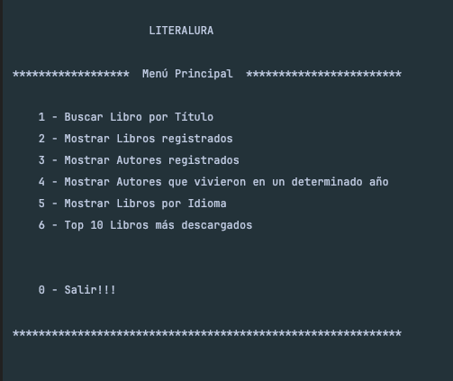

Busca Libro Solicitado por el usuario.
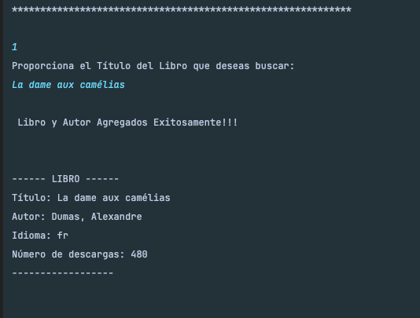

Muestra los Libros Registrados en la Base de Datos.
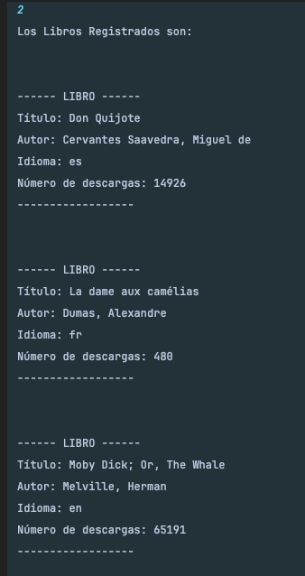

Muestra los Autores Registrados en la Base de Datos.
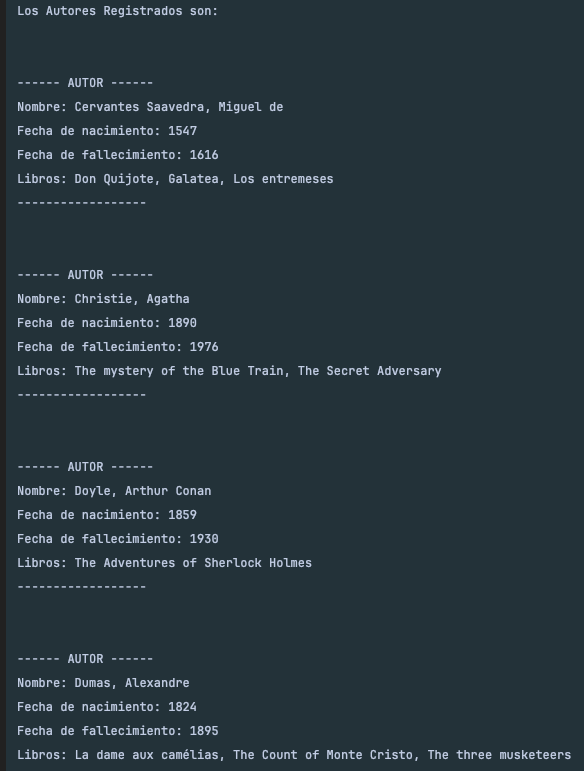

Muestra los Autores vivos en determinado año.
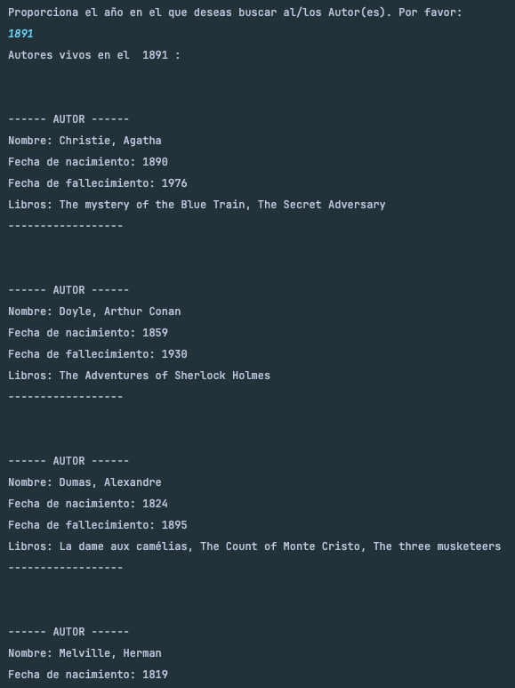

Muestra Libros por un determinado Idioma.
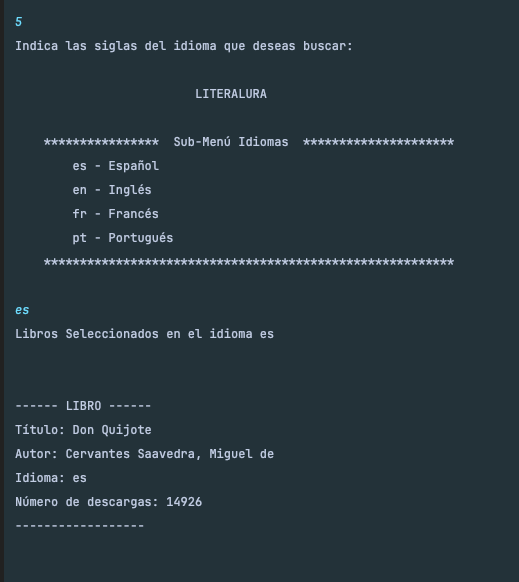

Top 10 Libros mas descargados en la Web.
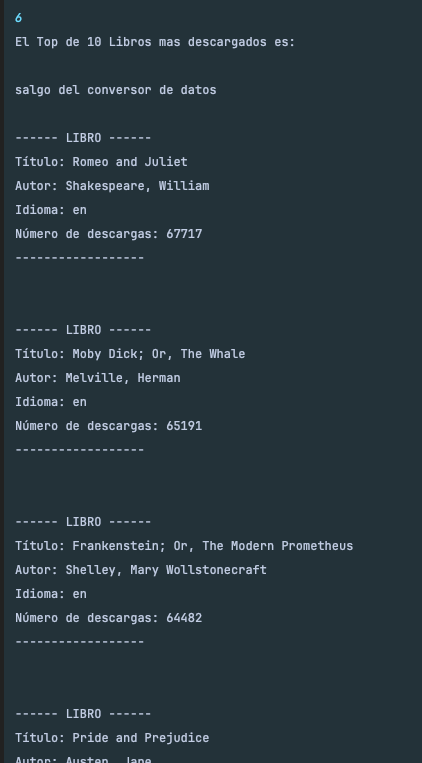

Opción de Menú no valida.
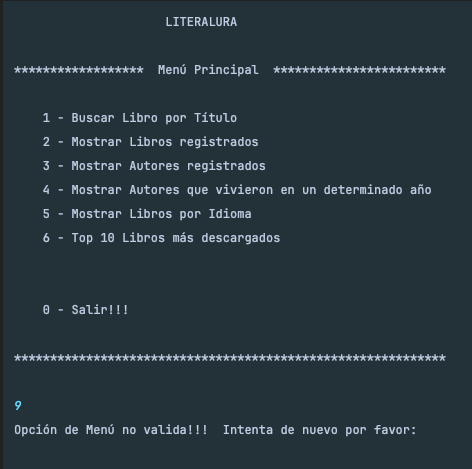

Mensaje de libro no encontrado en la base de Datos Externa.
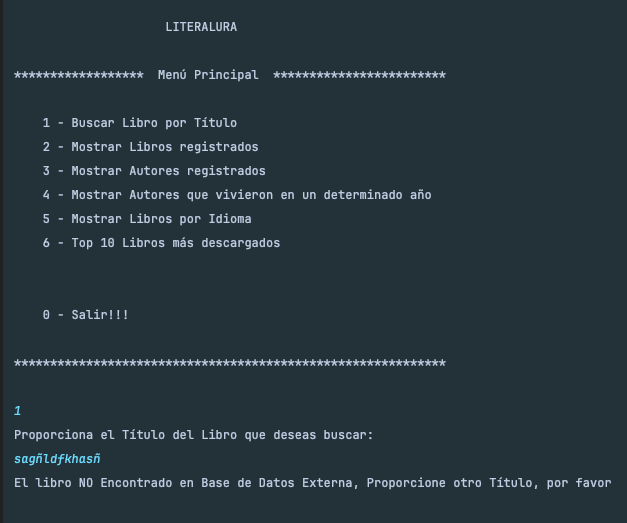

Base de Datos MySql Tabla Libros.
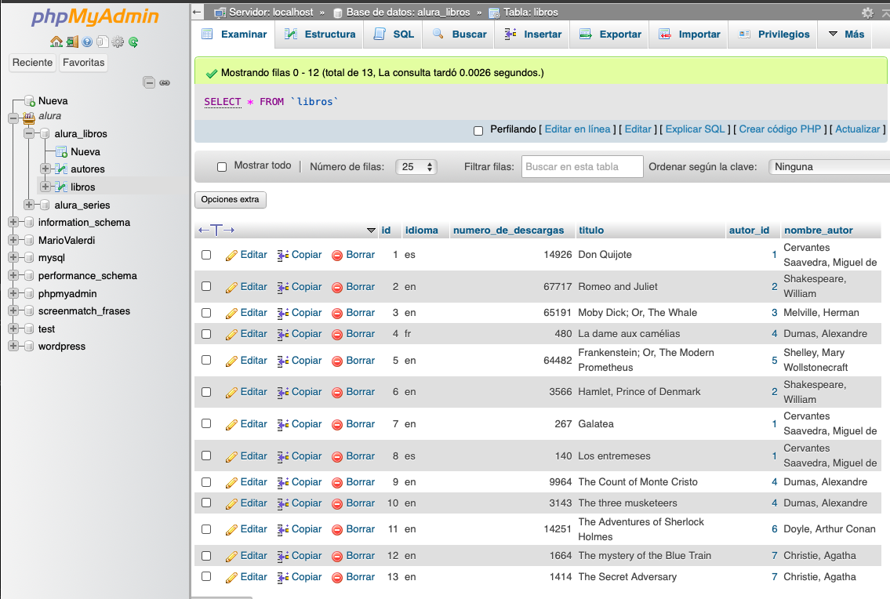

Base de Datos MySql Tabla Autores.
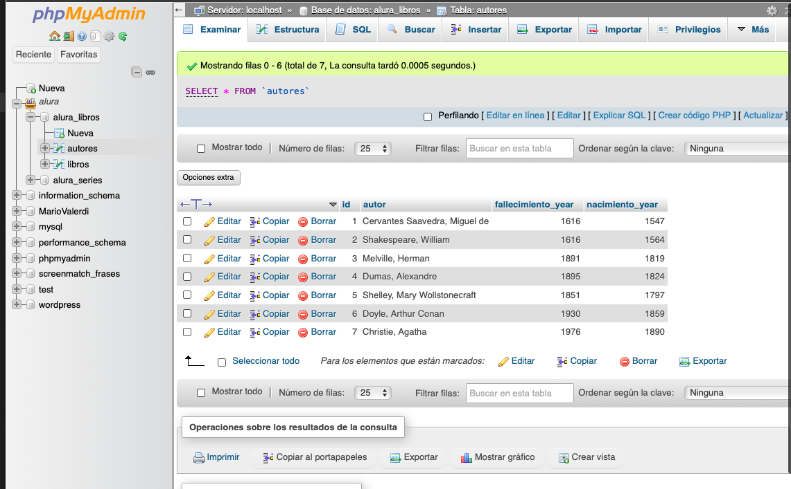

Salida y fin del sistema
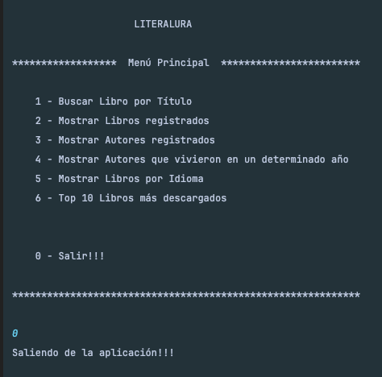

## Estado del Proyecto

El proyecto se encuentra en su versión 1.0.0.

## Acceso al Proyecto

Puedes acceder al proyecto y obtener el código fuente desde su repositorio en [GitHub LiterAlura](https://github.com/MAValerdi/LiterAlura).

## Instrucciones de Uso

1. Clona el repositorio desde GitHub.
2. Asegurate que el proyecto este en alguna ubicación en tu equipo local.
3. Importa el proyecto desde tu IDE Intellij IDEA o el IDE de tu preferencia.
4. Ejecuta la aplicación y sigue las instrucciones en pantalla.
5. Deberás instalar el servidor XAMPP.
6. Crear la base de datos en MySql desde phpMyAdmin de XAMPP
7. Veriricar y en su caso agregar las dependencias de MySql y Web en el archivo pom.xml

## Autor
Mario Alberto Valerdi Garduño
[Linkedin Mario Valerdi](https://www.linkedin.com/in/mariovalerdi).

#### Anotaciones finales:
Challenge "LITERALURA".
Del curso Java con Spring Boot
de ALURA Latam, Oracle ONE G6
